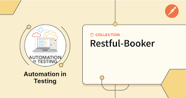

# Restfull Booker Management System

## Table of Contents

- [Introduction](#introduction)
- [Features](#features)
- [Installation](#installation)
- [Usage](#usage)
- [Contributing](#contributing)
- [License](#license)

## Introduction

Restfull Management System is a Library application that provides various booking services and features. This repository contains the source code for the Restfull Management System application.

## Examples

### Local Testing Execution Example

## Features

- *User Authentication*: Create and manage Users in Restfull For Specific Time .
- *Create Booking*: Create and Manage Booking in Restfull.
- *Update Booking*: Update and Manage Booking in Restfull.
- *Delete Booking*: Delete and Manage Booking in Restfull.

## Installation

To set up the Restfull Management System application locally, follow these steps:

1. Clone the repository:
*   git clone https://github.com/mahmoudreheem/Restfull-booker.git
2. Navigate to the project directory:
*   cd Restfull.git
3. Install dependencies:
*   npm install
4. Configure the application:

* Update configuration files with necessary settings.
5. Run the application:
*   npm start

## Usage
* User Guide: Refer to the User Guide for detailed information on how to use the Restfull application.

## Contributing
* We welcome contributions from the community. To contribute to Restfull application, follow these steps:

## Fork the repository.
* Create a new branch for your feature or bug fix.
* Make your changes and submit a pull request.

## License
* Restfull application is licensed under the MIT License.